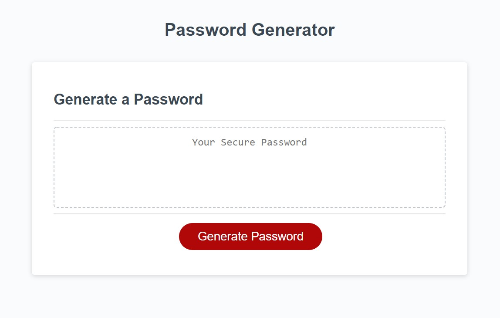
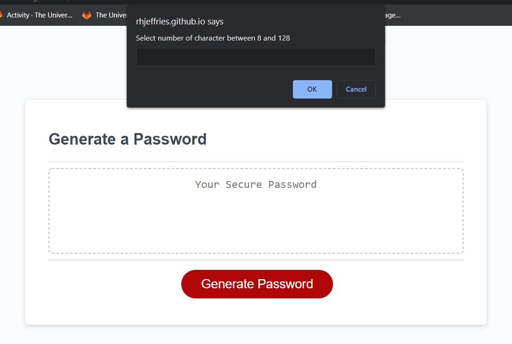

# Random-password-generator

## Description

Creating a unique password can be difficult and falling back on favourite foods, cities, 
or tv shows, can be easily guessed by someone with a little bit of knowledge about you. To 
help keep hackers (or maybe just the nosy) out of your accounts, a random password generator
could be the solution. 

With the Random Password Generator you cna quickly and easily have sometime new in a matter of a 
few clicks, simply click "Generate Password" and choose the desired length of the password (between 8 and 128 chararcters), decide whether 
to include lower and/or upper case letters, numbers and special characters. Once all selections have been made
a password is printed in the box for you. 

Please be aware that choosing a character limit less than 8 or more than 128 (or entering anything other than a number)
will stop the Random Password Generator and you'll need to start again. As well as choosing a minimum of one criteria 
(lower/upper case letters, numbers, or special characters), to generate a password. Without a selection, there is nothing to 
choose from and you'll need to start again.

## Screenshots

Screenshot of Random Password Generator 

Screen shot Random Password Generator with selection box 

## Links

* Github repository Random Password Generator [Github repository](https://github.com/RHJeffries/Random-password-generator)

* Deployed Random Password Generator page [deployed portfolio page](https://rhjeffries.github.io/Random-password-generator/)

